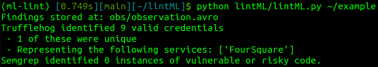

# ML-Lint

_The security linter for environments that shouldn't need linting._

Linters (and let's be honest with ourselves, any measures of code quality) have long been reserved for production environments. But we've increasingly seen that the most impactful machine learning attacks happen during **training time.** Traditional linters often rely on CI/CD pipelines or git commit hooks and are often opinionated on things like code formatting. However, many research never touches git until it is far down the path of productionization and researchers write some of the sloppiest code known to humankind (in the name of science). So how can we arm researchers with quick sanity checks for their research code? ML-Lint.

## Philosophy

ML-Lint is a simple python script (backed by dockerized security tools) that can give researchers and security teams some quick insight into potential risk in machine learning research projects. It checks for valid, plaintext credentials and uses static analysis to identify risky code patterns.

Things we check for:
1) **Plaintext credentials.**
2) **Unsafe deserialization.**
3) **Serialization to unsafe formats.**
4) **Training without augmentation.**
5) **Using untrustworthy assets.**
6) **Evidence of insecure services.**

Things we **don't** check for:
-  Formatting

## Compatibility

Currently ML-Lint is focused on `.py` and `.ipynb` files (based solely on the author's personal preferences).

## Foundations

The checks in ML-Lint are powered by [TruffleHog](https://github.com/trufflesecurity/trufflehog) and [Semgrep](https://semgrep.dev/). Currently, the linter relies on rules published by [Semgrep](https://semgrep.dev/p/python) and [Trail Of Bits](https://github.com/trailofbits/semgrep-rules), but rules tailored to machine learning training pipelines are coming soon.

ML-Lint uses [Apache Avro](https://avro.apache.org/) for data serialization to support fast operations and evolving schemas.

## Getting Started

1. `pip install -r requirements.txt`
2. `python ml-lint.py <your directory>`

When run from the CLI, ML-Lint will return a summary report.

Results are also persisted in `.avro` for later analysis and manipulation in your favorite data analysis tools.

## Contributing

To immediately contribute security outcomes, consider contributing new rules to TruffleHog and/or Semgrep.

To add a new security tool to ML-Lint, simply write an async function that returns [Observations](observation.py). PRs welcome.
