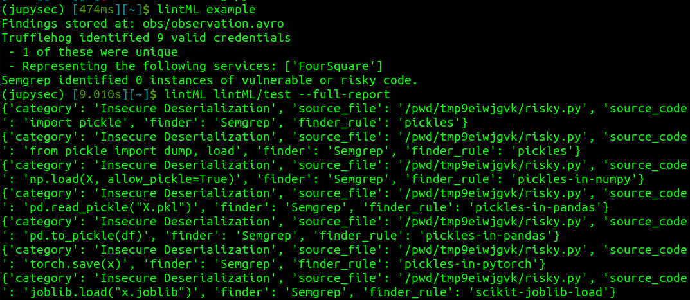

# lintML

_The security linter for environments that shouldn't need linting._

Linters (and let's be honest with ourselves, any measures of code quality) have long been reserved for production environments. But we've increasingly seen that the most impactful machine learning attacks happen during **training time.** Traditional linters often rely on CI/CD pipelines or git commit hooks and are often opinionated on things like code formatting. However, many research projects never touch git until they are far down the path of productionization and researchers write some of the sloppiest code known to humankind (in the name of science). So how can we arm researchers with quick sanity checks for their research code? lintML.

## Philosophy

lintML is a simple python script (backed by dockerized security tools) that can give researchers and security teams some quick insight into potential risk in machine learning research projects. It checks for valid, plaintext credentials and uses static analysis to identify risky code patterns.

Things we check for:

_(today)_

1) **Plaintext credentials.**
2) **Unsafe deserialization.**
3) **Serialization to unsafe formats.**
4) **Using untrustworthy assets.**

_(WIP)_

5) **Training without augmentation.**
6) **Evidence of insecure services.**

Things we **don't** check for:
- Formatting 

Many linters measure quality by the breadth of rules, leading to complicated CI/CD configurations where we're ignoring their flashing lights. With a linter for research and machine learning training code, we want to be high signal/low noise. Every rule represents a real exploitable vulnerability that you should _seriously_ consider engineering around to preserve the integrity of your research. lintML shouldn't distract you from getting stuff done. Ideally, most times when you run lintML, you'll have no alerts. :thumbsup:

## Compatibility

Currently lintML is focused on `.py` and `.ipynb` files (based solely on the author's personal preferences). TruffleHog supported both of these natively, but lintML uses [nbconvert](https://nbconvert.readthedocs.io/en/latest/) under the hood to support Semgrep on `.ipynb`.

## Foundations

The checks in lintML are powered by [TruffleHog](https://github.com/trufflesecurity/trufflehog) and [Semgrep](https://semgrep.dev/). Since lintML wraps these tools in their docker containers, the first execution may take longer as those containers are initially pulled.

lintML uses [Apache Avro](https://avro.apache.org/) for data serialization to support fast operations and evolving schemas.

## Getting Started

1. `pip install -r requirements.txt`
2. `python lintML.py <your directory>` -- If you don't specify a directory, lintML will default to the current working directory.

When run from the CLI, lintML will return a summary report.

3. To get a more detailed report, use the `--full-report` argument (`python lintML.py <your directory> --full-report`). Results are also persisted in `.avro` for later analysis and manipulation in your favorite data analysis tools.

## Requirements

Requirements are listed in [requirements.txt](requirements.txt), but the most notable requirement is the ability to build and run docker containers.

## Contributing

To immediately contribute security outcomes, consider contributing new rules to TruffleHog and/or Semgrep (and letting us know so we can import them).

Please also report any false positives or negatives to help us fine-tune rules or create new ones.

To add a new security tool to lintML, simply write an async function that returns [Observations](observation.py). PRs welcome.
